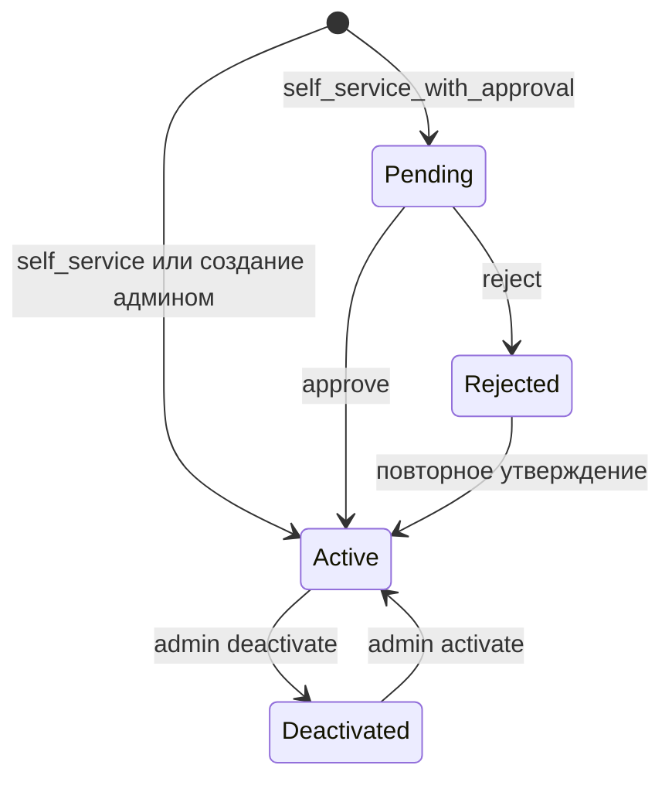

# Дизайн: три режима создания учётных записей

## 1. Обзор

Приложение получает новую переменную окружения `ACCOUNT_CREATION_MODE`, определяющую, как создаются учётные записи:

| Значение | Регистрация на шаге авторизации | Доступ после регистрации |
|---|---|---|
| `self_service` | Доступна | Сразу, без утверждения |
| `self_service_with_approval` | Доступна | Только после утверждения администратором |
| `admin_only` | Отключена | Создаёт только администратор, доступ сразу |

Значение по умолчанию — `admin_only` (сохраняет текущее поведение и наиболее безопасно).

## 2. Модель данных и статусная модель учётных записей

Файл: [`auth.go`](backend/api-service/internal/domain/auth.go:16) — структура [`domain.User`](backend/api-service/internal/domain/auth.go:16).

### 2.1. Новый тип статуса

```go
// AccountStatus represents the approval lifecycle of a user account
type AccountStatus string

const (
    AccountStatusActive   AccountStatus = "active"   // доступ разрешён
    AccountStatusPending  AccountStatus = "pending"  // ожидает решения администратора
    AccountStatusRejected AccountStatus = "rejected" // отклонён, доступ запрещён
)
```

### 2.2. Новые поля [`domain.User`](backend/api-service/internal/domain/auth.go:16)

```go
type User struct {
    // ... существующие поля ...
    AccountStatus   AccountStatus `gorm:"size:50;not null;default:active" json:"accountStatus"`
    StatusChangedAt *time.Time    `json:"statusChangedAt"`
    StatusChangedBy *uint         `json:"statusChangedBy"`
    RejectionReason string        `gorm:"size:500" json:"rejectionReason"`
}
```

### 2.3. Два ортогональных измерения состояния

| Поле | Смысл | Кто меняет | Влияние на доступ |
|---|---|---|---|
| `AccountStatus` | Жизненный цикл утверждения: active / pending / rejected | Регистрация, admin approve/reject | pending и rejected блокируют вход |
| `IsActive` | Административное отключение уже утверждённой учётной записи | Admin deactivate/activate | `false` блокирует вход |

Условие доступа к приложению: `IsActive == true AND AccountStatus == active`.

### 2.4. Диаграмма переходов статуса



`Deactivated` здесь — условное обозначение `IsActive = false`; оно не является значением `AccountStatus`.

### 2.5. Новые действия аудита

В [`domain.AuditAction`](backend/api-service/internal/domain/auth.go:56) добавить:

```go
ActionRegisterUser   AuditAction = "register_user"
ActionApproveUser    AuditAction = "approve_user"
ActionRejectUser     AuditAction = "reject_user"
```

## 3. Конфигурация

Файл: [`config.go`](backend/api-service/internal/infrastructure/config/config.go:30).

```go
// Auth configuration
AccountCreationMode string // "self_service" | "self_service_with_approval" | "admin_only"
```

В [`LoadConfig`](backend/api-service/internal/infrastructure/config/config.go:57):

```go
mode := getEnv("ACCOUNT_CREATION_MODE", "admin_only")
switch mode {
case "self_service", "self_service_with_approval", "admin_only":
default:
    // fail fast при недопустимом значении
    panic/log.Fatal("invalid ACCOUNT_CREATION_MODE")
}
```

Документировать в [`.env.example`](backend/api-service/.env.example:15).

## 4. API

### 4.1. Регистрация

`POST /api/auth/register` — публичный эндпоинт (маршрутизация в [`router.go`](backend/api-service/internal/interfaces/handler/router.go:36)).

Запрос:

```json
{ "login": "ivan", "displayName": "Иван", "password": "secret123" }
```

Ответ зависит от режима:

| Режим | Код | Ответ |
|---|---|---|
| `self_service` | 201 | `{ "user": UserDTO }` + установка session cookie (автовход) |
| `self_service_with_approval` | 201 | `{ "pending": true, "message": "..." }` без сессии и cookie |
| `admin_only` | 403 | `{ "error": "auth.registration_disabled" }` |

Роль всегда `user` — саморегистрация не может создать администратора.

### 4.2. Статус авторизации

`GET /api/auth/status` — расширить ответ ([`handleAuthStatus`](backend/api-service/internal/interfaces/handler/auth_handlers.go:55)):

```json
{
  "isAuthenticated": false,
  "isBootstrapMode": false,
  "accountCreationMode": "self_service_with_approval"
}
```

Поле `accountCreationMode` управляет условным отображением регистрации на фронтенде.

### 4.3. Утверждение и отклонение

`POST /api/admin/users/:id/approve` — admin only, без тела запроса.

`POST /api/admin/users/:id/reject` — admin only, тело:

```json
{ "reason": "Дубликат учётной записи" }
```

Ответ обоих: `{ "user": UserDTO, "message": "..." }`.

### 4.4. Список пользователей с фильтром

`GET /api/admin/users?status=pending` — расширить [`handleListUsers`](backend/api-service/internal/interfaces/handler/auth_handlers.go:264) необязательным query-параметром `status` для очереди заявок.

### 4.5. DTO

В [`dto/auth.go`](backend/api-service/internal/interfaces/dto/auth.go:22):

- расширить [`UserDTO`](backend/api-service/internal/interfaces/dto/auth.go:22) полями `accountStatus`, `statusChangedAt`, `rejectionReason`;
- добавить `RegisterRequest`, `RejectUserRequest`;
- расширить `AuthStatusResponse` полем `accountCreationMode`.

## 5. Пользовательские сценарии

### 5.1. self_service

1. Пользователь открывает шаг авторизации, видит ссылку «Создать учётную запись».
2. Заполняет login / displayName / password.
3. `POST /api/auth/register` → учётная запись создаётся сразу со статусом `active`, выдаётся сессия.
4. Пользователь сразу попадает в приложение.

### 5.2. self_service_with_approval

1. Пользователь регистрируется; учётная запись создаётся со статусом `pending`.
2. Пользователю показывается экран «Учётная запись ожидает одобрения администратора».
3. Администратор видит заявку в очереди, нажимает «Утвердить» или «Отклонить».
4. Утверждение → статус `active`, пользователь может войти.
5. Отклонение → статус `rejected`, вход запрещён; при попытке входа показывается сообщение об отклонении.

### 5.3. admin_only

1. На шаге авторизации ссылка регистрации отсутствует.
2. Администратор создаёт учётные записи через [`AdminPanel`](webapp/src/components/auth/AdminPanel.tsx:30) → статус `active` сразу.
3. `POST /api/auth/register` возвращает `403 registration_disabled` при прямом вызове.

### 5.4. Bootstrap-режим

Когда в базе нет пользователей, приоритет имеет bootstrap-инициализация: фронтенд показывает `BootstrapSetupScreen`, регистрация недоступна, `POST /api/auth/register` возвращает `409` (или `400`) с `auth.bootstrap_mode`.

## 6. Интерфейс шага авторизации

Файл: [`LoginScreen.tsx`](webapp/src/components/auth/LoginScreen.tsx:14).

- [`AuthProvider`](webapp/src/providers/AuthProvider.tsx:10) и [`authContext`](webapp/src/providers/authContext.ts:4) хранят `accountCreationMode`, полученный из `GET /api/auth/status`.
- В [`LoginScreen`](webapp/src/components/auth/LoginScreen.tsx:14) добавить переключатель «Вход / Регистрация», видимый только при `accountCreationMode !== "admin_only"`.
- Форма регистрации: `login`, `displayName`, `password`, подтверждение пароля.
- После успешной регистрации:
  - `self_service` → автовход через `login(user)`.
  - `self_service_with_approval` → отдельный экран `PendingApprovalScreen` с пояснением.
- Ошибка входа `pending`/`rejected` отображается конкретным сообщением, а не общей «Неверный логин или пароль».

## 7. Административная панель

Файл: [`AdminPanel.tsx`](webapp/src/components/auth/AdminPanel.tsx:30).

- Добавить секцию/вкладку «Заявки на регистрацию» (очередь `pending`).
- Для каждой заявки: login, displayName, дата запроса, кнопки «Утвердить» и «Отклонить»; при отклонении — диалог с необязательной причиной.
- В списке пользователей отображать бейдж статуса `active` / `pending` / `rejected`.
- Разрешить повторное утверждение `rejected` → `active`.

## 8. Обработка ошибок и граничные случаи

| Ситуация | Код | Сообщение |
|---|---|---|
| Регистрация в `admin_only` | 403 | `auth.registration_disabled` |
| Регистрация в bootstrap-режиме | 409 | `auth.bootstrap_mode` |
| Логин уже существует | 400 | `user_service.user_exists` |
| Короткий пароль | 400 | `auth.password_length` |
| Пустой login/displayName | 400 | `auth.invalid_request_format` |
| Слишком много попыток регистрации с IP | 429 | `auth.rate_limited` |
| Вход с `pending` | 403 | `auth.account_pending_approval` |
| Вход с `rejected` | 403 | `auth.account_rejected` |
| Вход с `IsActive=false` | 401 | `auth.account_deactivated` |
| Approve/reject не-pending пользователя | 409 | `auth.user_not_pending` |
| Approve/reject конкурентно вторым админом | 409 | `auth.user_not_pending` |
| Reject без причины | 400 | `auth.invalid_request_format` |

Правило неразглашения: сообщения `pending`/`rejected` возвращаются только после успешной проверки пароля, чтобы не раскрывать существование логина при неверном пароле.

## 9. Безопасность

- Пароль хэшируется существующей [`HashPassword`](backend/api-service/internal/application/auth/password.go) (bcrypt).
- Саморегистрация всегда создаёт роль `user`; роль не принимается из запроса.
- Отдельный rate limiter на регистрацию по IP (по образцу [`LoginRateLimiter`](backend/api-service/internal/application/auth/rate_limiter.go)).
- Нормализация логина: trim и lowercase при регистрации и при входе; уникальный индекс по нижнему регистру.
- `approve`/`reject` защищены [`RequireAdmin`](backend/api-service/internal/interfaces/middleware/auth.go:72) и глобальной CSRF-защитой.
- Для `pending`/`rejected` сессии не создаются.
- Аудит всех действий: `register_user`, `approve_user`, `reject_user`.

## 10. Миграции существующих данных

В [`database.go`](backend/api-service/internal/infrastructure/database/database.go:38) [`AutoMigrate`](backend/api-service/internal/infrastructure/database/database.go:38) автоматически добавит колонки:

- `account_status` с `DEFAULT 'active'` — все существующие пользователи станут `active` (доступ сохраняется, обратная совместимость);
- `status_changed_at`, `status_changed_by` (nullable);
- `rejection_reason` (пустая строка).

Дополнительно — сырой SQL для уникального индекса без учёта регистра:

```sql
CREATE UNIQUE INDEX IF NOT EXISTS idx_users_login_lower ON users (lower(login));
```

Перед созданием индекса необходимо проверить и разрешить существующие конфликты регистра (`Admin` vs `admin`).

## 11. Поведение при переключении режима

Режим читается из переменной окружения при старте; изменение требует перезапуска сервиса.

| Переход | Поведение |
|---|---|
| `admin_only` → `self_service` | Появляется саморегистрация; новые учётные записи сразу `active` |
| `admin_only` → `self_service_with_approval` | Появляется саморегистрация; новые учётные записи `pending` |
| `self_service` → `self_service_with_approval` | Новые регистрации `pending`; существующие `active` не меняются |
| `self_service_with_approval` → `self_service` | `pending` остаются `pending` до решения администратора; новые регистрации сразу `active` |
| любой → `admin_only` | Регистрация отключается; существующие учётные записи и заявки не меняются |

Автоматических массовых переходов статусов не выполняется.

## 12. Шаги реализации

Реализация разбита на пункты todo-листа в порядке выполнения: сначала доменная модель и конфигурация, затем сервисный слой и API, миграции, потом фронтенд и документация, с юнит-тестами после каждого изменения Go-кода.
