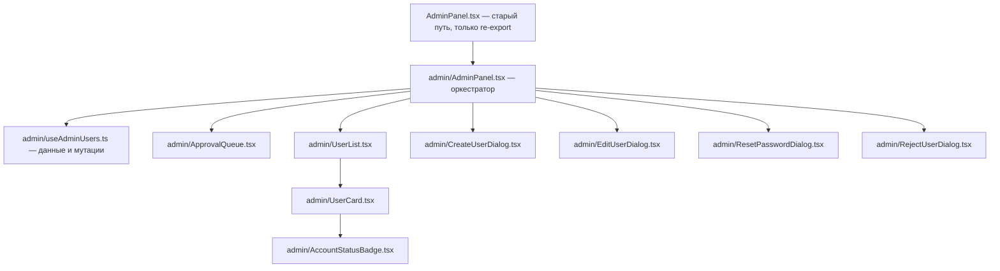

# План: снижение сложности AdminPanel через извлечение компонентов

## 1. Цель и проблема

[`AdminPanel.tsx`](webapp/src/components/auth/AdminPanel.tsx) — 602 строки, одно нарушение SRP:
компонент совмещает загрузку данных, очередь заявок на регистрацию, CRUD пользователей,
сброс пароля, approve/reject и содержит 6 вложенных компонентов.

Цель: разбить на модули с единой ответственностью **без изменения поведения и публичного API**.

## 2. Ограничения

- Именованный экспорт `AdminPanel` должен остаться доступным по пути
  `@/components/auth/AdminPanel` — его использует ленивый импорт в [`App.tsx:23`](webapp/src/App.tsx:23).
- Ключи i18n не менять (все существующие `adminPanel.*` остаются), en/ru не трогать.
- TypeScript strict, `import type` для типов, функциональные компоненты.

## 3. Целевая структура файлов

Создать папку `webapp/src/components/auth/admin/` (по образцу `components/gallery/lightbox/`):



| Файл | Содержимое | Источник в текущем файле |
|---|---|---|
| [`AdminPanel.tsx`](webapp/src/components/auth/AdminPanel.tsx) | Только `export { AdminPanel } from "./admin/AdminPanel"` — фасад для совместимости | строки 1–602 → заменяется |
| `admin/AdminPanel.tsx` | Оркестратор: guard роли, заголовок, композиция секций и диалогов, состояние открытия диалогов | строки 38–234 |
| `admin/useAdminUsers.ts` | Хук данных | строки 41–111 |
| `admin/ApprovalQueue.tsx` | Карточка очереди pending-заявок | строки 134–171 |
| `admin/UserList.tsx` | Список пользователей: loading / empty / grid | строки 173–216 |
| `admin/UserCard.tsx` | Карточка пользователя | строки 236–295 |
| `admin/AccountStatusBadge.tsx` | Бейдж статуса | строки 528–539 |
| `admin/CreateUserDialog.tsx` | Диалог создания | строки 297–379 |
| `admin/EditUserDialog.tsx` | Диалог редактирования | строки 381–465 |
| `admin/ResetPasswordDialog.tsx` | Диалог сброса пароля | строки 467–526 |
| `admin/RejectUserDialog.tsx` | Диалог отклонения заявки | строки 541–602 |

## 4. Хук данных `useAdminUsers`

Инкапсулирует состояние и мутации, убирает неочевидный паттерн ref-пересылки
(строки 73–87 текущего файла).

Контракт:

```typescript
interface UseAdminUsersResult {
  users: UserDTO[]
  pendingUsers: UserDTO[]
  isLoading: boolean
  isPendingLoading: boolean
  approve: (user: UserDTO) => Promise<void>
  reject: (user: UserDTO, reason: string) => Promise<void>
  removeUser: (user: UserDTO) => Promise<void>
  toggleActive: (user: UserDTO) => Promise<void>
  refresh: () => void
}
```

Детали:

- Единый `useEffect` для первичной загрузки `users` и `pendingUsers`
  (без ref-паттерна: зависимости эффекта пустые, загрузчики объявляются внутри хука
  или оборачиваются так, чтобы эффект был стабилен).
- Каждая мутация выполняет API-вызов, показывает toast об успехе/ошибке
  (через [`translateApiMessage`](webapp/src/api/client.ts:10)) и вызывает refresh обеих списков.
- Ошибка загрузки `pendingUsers` остаётся некритичной, но логируется через `console.error`
  вместо молчаливого `catch {}`.
- `approve`/`reject` используют [`approveUser`](webapp/src/api/endpoints.ts) / [`rejectUser`](webapp/src/api/endpoints.ts).

## 5. Контракты пропсов

Каждый извлечённый компонент получает только то, что использует:

- `ApprovalQueue`: `users`, `isLoading`, `onApprove(user)`, `onRejectRequest(user)`.
- `UserList`: `users`, `isLoading`, `currentUserId`, `onEdit`, `onResetPassword`, `onDelete`, `onToggleActive`.
- `UserCard`: текущие пропсы из строк 236–250 без изменений.
- Диалоги: текущие пропсы без изменений (`open`/`onOpenChange`/`onSuccess`, `user`/`onClose` и т.д.);
  после успеха диалог вызывает `onSuccess` → `refresh` из хука.

Типы пропсов объявлять как `interface` рядом с компонентом; `UserDTO`, `AccountStatus`, `UserRole`
импортировать через `import type` из [`@/types`](webapp/src/types/index.ts).

## 6. Порядок выполнения

1. Создать папку `admin/` и перенести в неё 6 компонентов (UserCard, AccountStatusBadge,
   4 диалога) без изменений логики.
2. Создать `useAdminUsers.ts`, перенести в него состояние, загрузку и обработчики
   approve/reject/delete/toggle из оркестратора.
3. Извлечь `ApprovalQueue` и `UserList`; оркестратор `admin/AdminPanel.tsx` оставляет
   только guard роли, заголовок, состояние диалогов и композицию.
4. Заменить старый [`AdminPanel.tsx`](webapp/src/components/auth/AdminPanel.tsx) на re-export фасад.
5. Проверки: `npm run build` в `webapp/` (tsc + vite), eslint,
   тест i18n [`translations.test.ts`](webapp/src/i18n/translations.test.ts),
   ручной smoke-тест панели администратора (очередь, CRUD, сброс пароля, reject).

## 7. Что НЕ делать

- Не менять ключи i18n и тексты.
- Не менять API-контракты и DTO.
- Не менять поведение (те же тосты, подтверждения через `confirm`, условия показа).
- Не вводить новые библиотеки и паттерны (без state-management библиотек).
